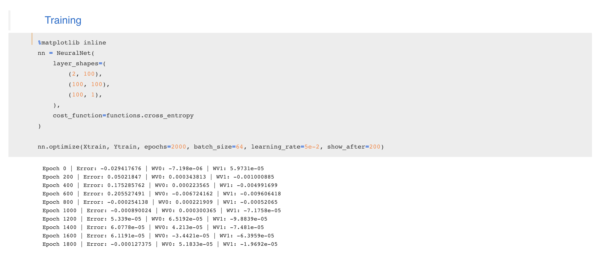
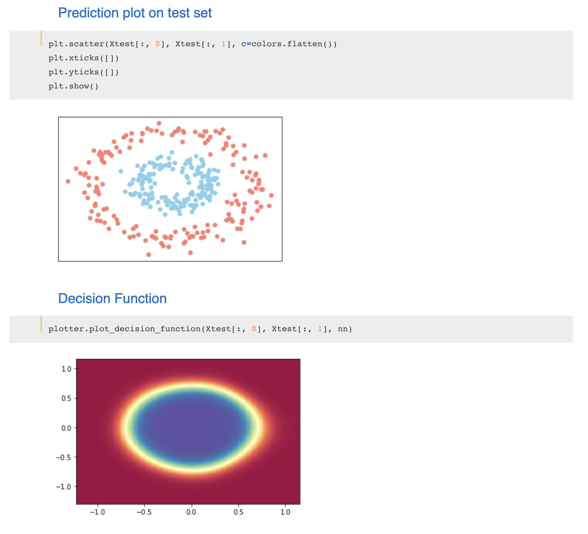

# NeuralNet

A Neural Network implementation using **only** `numpy`! :octocat:

This is a project created for my own learning purposes. The main goal is to build a library for neural network training and optimization, but with a focus on understanding how they estimate weights and how different techniques affect those estimations.

Some examples on the usage can be cound on [/examples/](https://github.com/next-manuelmartin5/neural-network-implementation/tree/feature/add-cost-functions/examples) directory.

**Neural Network definition example**

**Decision Function Plotting example**

##### Currently Supported
- Vectorized backpropagation
- Sigmoid activation
- Multilayer NN
- He-Normal weights initialization
- Batch Stochastic gradient descent
- MSE loss
- Cross Entropy loss
- Optimization progression plot option during training
- Return History of error and weights change

##### Backlog of features
- Gradient Checking
- Validation set evaluation during Training
- Softmax and ReLu activations
- Dropout and Early Stopping
- Automatic differentiation for agnostic activations and cost functions.
